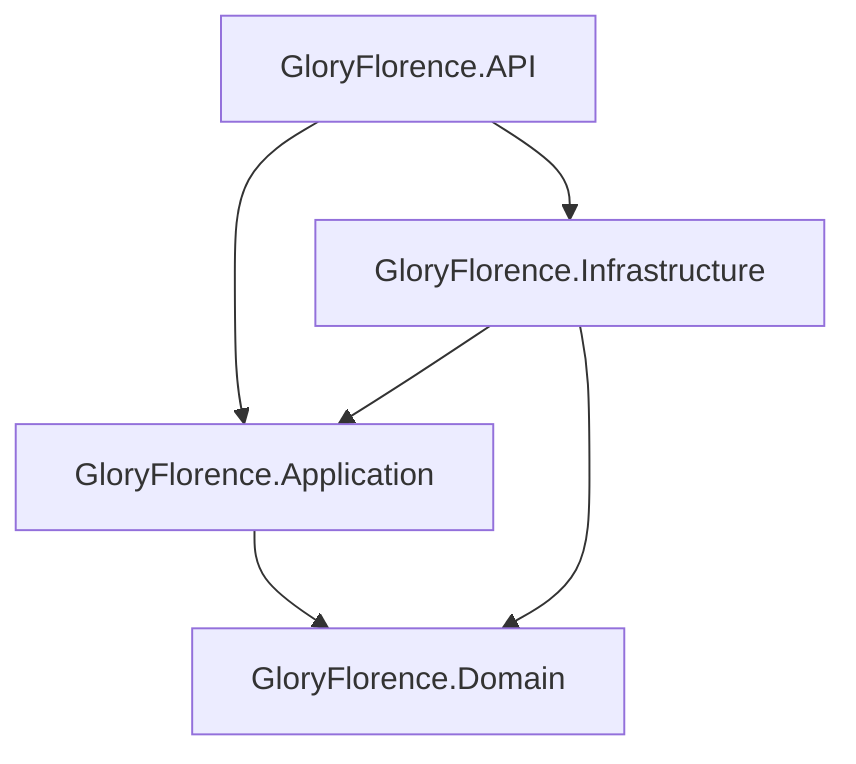

# 🏥 Glory Florence Physiotherapy Management System — Backend API

[](https://dotnet.microsoft.com/download/dotnet/8.0)
[](https://learn.microsoft.com/dotnet/csharp/)
[](https://learn.microsoft.com/ef/core/)
[](https://www.microsoft.com/sql-server/)
[](https://jwt.io/)
[](https://swagger.io/)
[](https://learn.microsoft.com/dotnet/architecture/modern-web-apps-azure/common-web-application-architectures#clean-architecture)
[](LICENSE)

A robust, enterprise-grade **Physiotherapy & Rehabilitation Practice Management System (EHR/ERP)** backend built with **ASP.NET Core Web API (.NET 8)** following **Clean / Onion Architecture**. Designed to empower physiotherapy clinics with comprehensive electronic health records, conflict-free scheduling, clinical assessment pipelines, individualized treatment planning, VAS pain trajectory analytics, and strict role-based access control (RBAC).

---

## 🏛️ Clean Architecture Overview

The solution adheres strictly to Clean Architecture separation of concerns:

```
GloryFlorence/
├── GloryFlorence.Domain/           # Enterprise Core (Entities, Enums, Constants, Rules)
├── GloryFlorence.Application/      # Business Logic (DTOs, Interfaces, Services, Validators)
├── GloryFlorence.Infrastructure/   # Persistence & External (DbContext, Repositories, Migrations, Auth)
└── GloryFlorence.API/              # Presentation Layer (Controllers, Middleware, Swagger, Program.cs)
```



- **Domain**: Pure C# domain entities, audit logs, role constants, and database relationships with zero external dependencies.
- **Application**: Service contracts, request/response DTOs, FluentValidation rules, business orchestration, and custom exception handling.
- **Infrastructure**: Entity Framework Core 8, Microsoft SQL Server configurations, database seeders, JWT token generation, and repository / unit-of-work implementations.
- **API**: REST controllers inheriting from `BaseApiController`, JWT authentication handlers, CORS policies, Swagger/OpenAPI schemas, and global exception-handling middleware.

---

## ✨ Key Features & Modules

### 🔐 1. Authentication & Role-Based Access Control (RBAC)
- **JWT Bearer Token Authentication**: High-security token generation with HMAC-SHA256 signing, customizable expiration, issuer, and audience validation.
- **7 Clinical Roles**:
  - `SuperAdmin` — Complete clinical and system administration
  - `Admin` — Practice and clinic operations management
  - `Physiotherapist` — Clinical assessments, treatment plans, and session evaluations
  - `Doctor` — Referring practitioner and diagnostic reviews
  - `Receptionist` — Patient registration and front-desk appointment scheduling
  - `Accountant` — Billing, invoices, and payment tracking
  - `Patient` — Self-service appointments and medical summaries
- **Endpoints**: `/api/auth/login`, `/api/auth/me`.

### 👥 2. Patient Directory & EHR Records
- **Patient Dossier**: Demographics, date of birth, gender, blood group, contact info, and medical history.
- **Medical History Timeline**: Detailed diagnostic history, symptoms, prior therapies, and physician remarks.
- **Medical Documents**: Document metadata management and file upload handling with dedicated file-system storage under `/wwwroot/uploads/documents`.

### 📅 3. Smart Appointment Scheduling & Conflict Engine
- **Lifecycle Tracking**: `Scheduled` ➔ `Confirmed` ➔ `In Progress` ➔ `Completed` / `Cancelled` / `Rescheduled` / `No Show`.
- **Conflict Prevention Engine**: Validates practitioner schedule availability before booking to eliminate double-booking overlaps (`/api/appointments/check-conflict`).
- **Reschedule & Cancellation Audits**: Native endpoints for rescheduling time slots and recording cancellation reasons.

### 🩺 4. Clinical Assessment & VAS Pain Tracking
- **Pain Level Scale (VAS 0–10)**: Clinical measurement tracking pain levels before and after rehabilitation sessions.
- **Diagnostic Dossier**: Captures chief complaint, current physical condition, range of motion (ROM) deficits, clinical diagnosis, and therapeutic recommendations.

### 📋 5. Treatment Plans & Modalities
- **Custom Care Plans**: Multi-session treatment packages linked directly to initial clinical assessments.
- **Modalities**: Manual Therapy, Ultrasound Therapy, Electrotherapy (TENS/IFT), Cryotherapy, and Guided Exercise Sessions with individual frequency and duration settings.

### 🏋️ 6. Clinical Exercise Master & Treatment Types
- **Exercise Library**: Curated rehabilitation exercises with step-by-step instructions, target muscle classifications, hold durations, and reference image/video URLs.
- **Treatment Types**: Configurable billing tariffs, default session durations, and category linkages.

### 🗄️ 7. Clinical Audit Logging
- Healthcare-grade mutation auditing: records `Action`, `EntityName`, `EntityId`, `NewValue`, `IPAddress`, and `UserId` whenever clinical records, assessments, or treatment sessions are altered.

---

## 🛠️ Technology Stack

| Layer / Concern | Technology |
| :--- | :--- |
| **Runtime & SDK** | [.NET 8.0 SDK](https://dotnet.microsoft.com/download/dotnet/8.0) |
| **Language** | [C# 12](https://learn.microsoft.com/dotnet/csharp/) |
| **ORM / Data Access** | [Entity Framework Core 8](https://learn.microsoft.com/ef/core/) (Code-First) |
| **Database** | [Microsoft SQL Server](https://www.microsoft.com/sql-server/) (or LocalDB / Express / Docker) |
| **Authentication** | JWT Bearer (`Microsoft.AspNetCore.Authentication.JwtBearer`) |
| **Password Hashing** | [BCrypt.Net-Next](https://www.nuget.org/packages/BCrypt.Net-Next/) |
| **Validation** | [FluentValidation.AspNetCore](https://fluentvalidation.net/) |
| **API Documentation** | [Swagger / OpenAPI (Swashbuckle)](https://github.com/domaindrivendev/Swashbuckle.AspNetCore) |
| **Architecture** | Clean Architecture / Repository & Unit of Work Pattern |

---

## 📁 Repository Structure

```text
GloryFlorence/
├── .env.example                                      # Environment variables template
├── .gitignore                                        # Comprehensive .NET / Visual Studio gitignore
├── README.md                                         # Project documentation
├── GloryFlorence.sln                                 # Visual Studio Solution File
├── GloryFlorence.API/                                # Web API Entry Point
│   ├── Controllers/                                  # REST API Controllers
│   ├── Middleware/                                   # Global Exception Handler
│   ├── Properties/                                   # launchSettings.json
│   ├── wwwroot/                                      # Static files & document uploads
│   ├── appsettings.json                              # Sanitized template configuration
│   ├── appsettings.Example.json                      # Reference example configuration
│   └── Glory Florence Management System.http         # Visual Studio REST Client test suite
├── GloryFlorence.Application/                        # Application Business Logic
│   ├── Common/                                       # Pagination & Exceptions
│   ├── DTOs/                                         # Data Transfer Objects
│   ├── Interfaces/                                   # Service & Repository interfaces
│   ├── Services/                                     # Use-case implementations
│   └── Validators/                                   # FluentValidation rules
├── GloryFlorence.Domain/                             # Core Domain Layer
│   ├── Common/                                       # BaseEntity
│   ├── Constants/                                    # Roles definitions
│   └── Entities/                                     # Domain Entities
└── GloryFlorence.Infrastructure/                     # Data & Infrastructure
    ├── Data/                                         # ApplicationDbContext & Seed Data
    ├── Data/Configurations/                          # EF Core Fluent API mappings
    ├── Migrations/                                   # EF Core Schema Migrations
    ├── Repositories/                                 # Generic Repository & Unit of Work
    └── Services/                                     # TokenService & CurrentUserService
```

---

## 🔒 Security & Git Protection

To ensure **zero sensitive data or credentials leak into version control**, this repository enforces:

1. **Sanitized `appsettings.json`**: Only contains placeholder values.
2. **Gitignored Local Settings**: `appsettings.Development.json`, `appsettings.Production.json`, and `appsettings.Local.json` are strictly ignored by `.gitignore`.
3. **Protected Patient Uploads**: Real medical files uploaded to `wwwroot/uploads/**` are ignored by git; only directory placeholders (`.gitkeep`) are committed.
4. **Environment Variables**: `.env` and local secrets are excluded; refer to `.env.example` or `appsettings.Example.json`.

---

## 🚀 Getting Started

### Prerequisites

Ensure you have the following installed:
- [.NET 8.0 SDK](https://dotnet.microsoft.com/download/dotnet/8.0)
- [Microsoft SQL Server](https://www.microsoft.com/sql-server/) (or SQL Server Express / LocalDB / Docker)
- [EF Core CLI Tool](https://learn.microsoft.com/ef/core/cli/dotnet) (optional, install with `dotnet tool install --global dotnet-ef`)
- Code Editor: Visual Studio 2022 (v17.8+), VS Code with C# Dev Kit, or JetBrains Rider

---

### Step 1: Clone the Repository

```bash
git clone https://github.com/YOUR_USERNAME/GloryFlorence.git
cd GloryFlorence
```

---

### Step 2: Configure Application Settings

Create your local settings file by copying `appsettings.Example.json` into `GloryFlorence.API/appsettings.Development.json`:

```bash
cp GloryFlorence.API/appsettings.Example.json GloryFlorence.API/appsettings.Development.json
```

Open `GloryFlorence.API/appsettings.Development.json` and adjust the SQL Server connection string and JWT Secret:

```json
{
  "Logging": {
    "LogLevel": {
      "Default": "Information",
      "Microsoft.AspNetCore": "Warning"
    }
  },
  "ConnectionStrings": {
    "DefaultConnection": "Server=localhost;Database=GloryFlorenceDb;Trusted_Connection=True;MultipleActiveResultSets=true;TrustServerCertificate=True"
  },
  "JwtSettings": {
    "Secret": "SuperSecretKeyForGloryFlorenceManagementSystem12345!",
    "Issuer": "GloryFlorenceAPI",
    "Audience": "GloryFlorenceClient",
    "ExpiryInMinutes": 180
  }
}
```

> [!TIP]
> Alternatively, you can use `.NET User Secrets` during development:
> ```bash
> dotnet user-secrets set "ConnectionStrings:DefaultConnection" "Server=localhost;Database=GloryFlorenceDb;Trusted_Connection=True;TrustServerCertificate=True" --project GloryFlorence.API
> dotnet user-secrets set "JwtSettings:Secret" "YourStrongSecretKeyHere32CharactersLong!" --project GloryFlorence.API
> ```

---

### Step 3: Database Migration & Automatic Seeding

The application automatically applies pending migrations and executes data seeding on startup.

If you prefer applying migrations manually via the command line:

```bash
dotnet ef database update --project GloryFlorence.Infrastructure --startup-project GloryFlorence.API
```

The startup seeder automatically initializes:
- ✅ **Roles**: SuperAdmin, Admin, Physiotherapist, Doctor, Receptionist, Accountant, Patient
- ✅ **Demo Accounts**: Pre-configured user accounts for each role
- ✅ **Lookups**: Genders, Blood Groups, Countries, States, Cities, Specializations, Categories, Statuses
- ✅ **Sample Clinical Data**: Patients, assessments, active treatment plans, exercise library, appointments, and audit trails

---

### Step 4: Run the Application

Run the API using the .NET CLI:

```bash
dotnet run --project GloryFlorence.API
```

Or using file watcher for hot reload:

```bash
dotnet watch --project GloryFlorence.API
```

The API will start listening on:
- **HTTP**: `http://localhost:5222`
- **HTTPS**: `https://localhost:7145`
- **Swagger Documentation**: [http://localhost:5222/swagger](http://localhost:5222/swagger)

---

## 🔑 Default Seed User Accounts (For Testing)

All seeded accounts are initialized with BCrypt password hashing:

| Role | Username | Email | Default Password | Access Level |
| :--- | :--- | :--- | :--- | :--- |
| **SuperAdmin** | `admin` | `admin@gloryflorence.com` | `Admin123!` | System Full Access |
| **Admin** | `clinicadmin` | `clinicadmin@gloryflorence.com` | `Admin123!` | Practice & Operations Admin |
| **Physiotherapist** | `therapist` | `therapist@gloryflorence.com` | `Therapist123!` | Clinical EHR, Plans, Sessions |
| **Doctor** | `doctor` | `doctor@gloryflorence.com` | `Doctor123!` | Patient History & Diagnosis |
| **Receptionist** | `receptionist` | `receptionist@gloryflorence.com` | `Receptionist123!` | Scheduling & Intake |
| **Accountant** | `accountant` | `accountant@gloryflorence.com` | `Accountant123!` | Billing & Invoicing |
| **Patient** | `patientuser` | `patientuser@gloryflorence.com` | `Patient123!` | Patient Portal Access |

---

## 📡 API Endpoints Overview

| Area | HTTP Method | Route | Description |
| :--- | :--- | :--- | :--- |
| **Auth** | `POST` | `/api/auth/login` | Authenticate user & receive JWT token |
| | `GET` | `/api/auth/me` | Retrieve profile of authenticated user |
| **Patients** | `GET` | `/api/patients` | Paginated list of patients with search filters |
| | `POST` | `/api/patients` | Register new patient with validation |
| | `GET` | `/api/patients/{id}` | Get full patient EHR record |
| | `PUT` | `/api/patients/{id}` | Update patient details |
| | `DELETE` | `/api/patients/{id}` | Deactivate / remove patient |
| | `GET` | `/api/patients/{id}/medical-history` | List diagnostic history records |
| | `POST` | `/api/patients/{id}/medical-history` | Add clinical history entry |
| | `POST` | `/api/patients/{id}/documents/upload`| Upload medical document attachment |
| **Appointments** | `GET` | `/api/appointments` | Query appointments by date range, therapist, patient |
| | `POST` | `/api/appointments` | Book appointment with conflict checking |
| | `POST` | `/api/appointments/check-conflict` | Validate therapist schedule overlap |
| | `POST` | `/api/appointments/{id}/reschedule`| Shift appointment time slot |
| | `POST` | `/api/appointments/{id}/cancel` | Cancel booking with audit reason |
| **Clinical Assessments** | `GET` | `/api/assessments` | Query clinical evaluations |
| | `POST` | `/api/assessments` | Record intake assessment & VAS pain score |
| | `GET` | `/api/assessments/{id}` | Retrieve clinical diagnosis & recommendations |
| **Treatment Plans** | `GET` | `/api/treatment-plans` | Retrieve treatment packages & active goals |
| | `POST` | `/api/treatment-plans` | Create multi-session treatment protocol |
| | `GET` | `/api/treatment-plans/{id}` | Get plan details & modality bundle |
| **Treatment Sessions** | `GET` | `/api/treatment-sessions` | Query rehabilitation sessions |
| | `POST` | `/api/treatment-sessions` | Record session notes & pre/post pain delta |
| **Exercise Master** | `GET` | `/api/exercises` | Browse rehabilitation exercise catalog |
| | `POST` | `/api/exercises` | Add new clinical exercise prescription |
| **Master Data** | `GET` | `/api/masterdata/statuses` | Query generic clinical statuses |
| | `GET` | `/api/masterdata/countries` | Geographic country list |
| | `GET` | `/api/masterdata/specializations` | Physiotherapy specialty list |

---

## 🧪 Testing with VS REST Client

You can test the live API directly using the included Visual Studio / VS Code REST Client test file:

📂 [`GloryFlorence.API/Glory Florence Management System.http`](GloryFlorence.API/Glory%20Florence%20Management%20System.http)

1. Open the file in Visual Studio or VS Code (with the *REST Client* extension).
2. Execute **Request #1** (`POST /api/auth/login`) to obtain the JWT token for `admin`.
3. Subsequent requests automatically bind `@token` in the `Authorization: Bearer {{token}}` header.

---

## 🤝 Frontend Pairing

This API connects directly with the **Glory Florence Frontend** (built with React 19, TypeScript, and Vite).
- The default CORS policy permits `http://localhost:3000` with credential support.
- CORS policy can be adjusted in [`GloryFlorence.API/Program.cs`](GloryFlorence.API/Program.cs).

---

## 📜 License

This project is licensed under the [MIT License](LICENSE).
